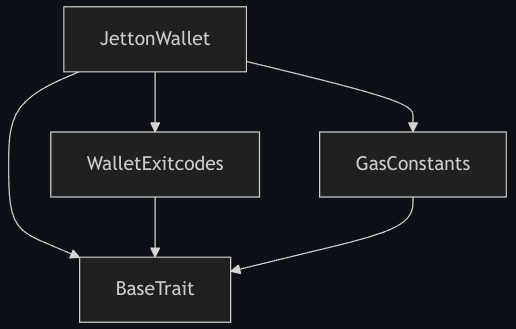
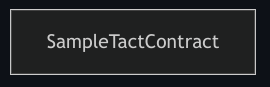
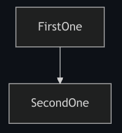
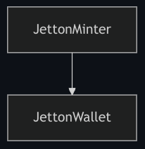

import { Badge } from '@astrojs/starlight/components';

:::note

  Эта страница всё ещё находится в процессе написания, см. [#1136](https://github.com/tact-lang/tact/issues/1136).

:::

Компилятор Tact может создавать различные выходные данные, начиная от [BoC](/ru/book/cells#cells-boc) скомпилированного контракта и заканчивая различными дополнительными файлами, такими как [отчёт о компиляции](#report) или [пакет контракта](/ru/ref/evolution/otp-006), который представляет собой файл JSON с расширением `.pkg`, который можно использовать для [проверки происхождения смарт-контракта](https://verifier.ton.org).

С помощью соответствующих [настроек конфигурации](/ru/book/config), вы можете настроить поведение компилятора, чтобы пропустить генерацию некоторых или всех [артефактов сборки](#artifacts), а также управлять добавлением или исключением [геттеров для поддерживаемых интерфейсов](/ru/book/contracts#interfaces).

Поскольку компилятор Tact является программой командной строки, некоторые настройки конфигурации можно задать напрямую. Если вы находитесь в папке с проектом на основе Tact, например, созданным с помощью [Blueprint](https://github.com/ton-org/blueprint) или [tact-template](https://github.com/tact-lang/tact-template), используйте команду `npx tact --help{:shell}` для получения дополнительных инструкций.

## Артефакты сборки {#artifacts}

При компиляции каждого контракта может быть создано несколько артефактов сборки. Некоторые из артефактов можно исключить с помощью [настроек конфигурации](/ru/book/config).

Местоположение артефактов зависит от поля [`output`](/ru/book/config#projects-output) в [`tact.config.json`](/ru/book/config). В проектах на основе [Blueprint][bp] `output`не используется, и все сгенерированные файлы всегда размещаются в `build/ProjectName/`.

### Отчёт о компиляции, `.md` {#report}

Каждый отчёт о компиляции в формате markdown сначала содержит название контракта, для которого он был подготовлен, а затем размер контракта в байтах, скомпилированного в [BoC](/ru/book/cells#cells-boc).

В следующих подзаголовках описаны соответствующие разделы `.md` отчёта.

#### Структуры {#structures}

<Badge text="До Tact 1.6 использовалось название '# Types' " variant="tip" size="medium"/><p/>

В первом разделе представлены существующие структуры, то есть некоторые [составные типы](/ru/book/types#composite-types), [структуры и сообщения](/ru/book/structs-and-messages) которые объявляются или импортируются непосредственно в код контракта, а также те, которые предоставляются стандартной библиотекой Core.

Помимо количества существующих структур, каждая из [структур][struct] и [сообщений][message] описывается с их соответствующими сигнатурами и [TL-B схемами][tlb], которые включают [опкоды сообщений](/ru/book/structs-and-messages#message-opcodes).

Например:

```md
Total structures: 10

### StateInit
TL-B: `_ code:^cell data:^cell = StateInit`
Signature: `StateInit{code:^cell,data:^cell}`

### Deploy
TL-B: `deploy#946a98b6 queryId:uint64 = Deploy`
Signature: `Deploy{queryId:uint64}`

...etc.
```

[TL-B схема][tlb] каждого [сообщения][message] содержит его опкод, что удобно для поиска автоматически сгенерированных опкодов, а также для подтверждения [вручную заданных кодов](/ru/book/structs-and-messages#message-opcodes). Например, следующие объявления [сообщений][message]:

```tact
message GeneratedOpcode { }
message(0x12345678) ManuallySpecifiedOpcode { }
```

преобразуются в соответствующие [TL-B схемы][tlb]:

```md
### GeneratedOpcode
TL-B: `generated_opcode#6dfea180  = GeneratedOpcode`
Signature: `GeneratedOpcode{}`

### ManuallySpecifiedOpcode
TL-B: `manually_specified_opcode#12345678  = ManuallySpecifiedOpcode`
Signature: `ManuallySpecifiedOpcode{}`
```

где `6dfea180` и `12345678` указанные после `#` в [определениях конструкторов](https://docs.ton.org/v3/documentation/data-formats/tlb/tl-b-language#constructors) являются кодами операций, записанными в шестнадцатеричном формате, представляющими $32$-битные беззнаковые целые числа. Таким образом, автоматически сгенерированный опкод `6dfea180` для `GeneratedOpcode{:tact}` [сообщения][message] представляет десятичное значение $1845404032$, а вручную заданный опкод `12345678` для `ManuallySpecifiedOpcode{:tact}` [сообщения][message] представляет десятичное значение $305419896$, а **не** $12345678$ как может показаться.

#### Get-методы {#getters}

В этом разделе указано количество доступных get-методов или [геттер-функций](/ru/book/functions#getter-functions) а также приводится их описание с названиями аргументов, если они есть.

Например:

```md
Total get methods: 2

## lshift
Argument: x

## gas
```

Например, геттер `lshift(){:tact}` принимает один аргумент `x`, тогда как геттер `gas(){:tact}` не имеет аргументов.

#### Коды завершения {#exit-codes}

В этом разделе перечислены все стандартные [коды завершения](/ru/book/exit-codes),а также коды, сгенерированные из сообщений об ошибках [`require(){:tact}`](/ru/ref/core-debug#require), вместе с этими сообщениями для удобства.

Например:

```md
* 2: Stack underflow
* 3: Stack overflow
...etc.
* 135: Code of a contract was not found
* 42933: Hey, I'm the error message of require()
```

При этом [коды завершения](/ru/book/exit-codes) в диапазоне от $0$ до $255$ зарезервированы для TON Blockchain или компилятора Tact, тогда как код завершения $42933$ создаётся соответствующим вызовом функции [`require(){:tact}`](/ru/ref/core-debug#require).

#### Диаграмма наследования трейтoв {#trait-diagram}

В этом разделе представлена диаграмма [Mermaid][mm] [унаследованных трейтов](/ru/book/contracts#traits), включая [`BaseTrait{:tact}`](/ru/ref/core-base).

Например:



Например, [`JettonWallet`][code-jetton-wallet] наследует трейты `WalletExitcodes` и `GasConstant` а все они, в свою очередь, наследуют [`BaseTrait{:tact}`](/ru/ref/core-base).

#### Диаграмма зависимостей контракта {#contract-diagram}

В этом разделе представлена диаграмма [Mermaid][mm] зависимостей [контрактов](/ru/book/contracts) то есть всех вызовов [`initOf{:tact}`](/ru/book/expressions#initof) используемых для вычисления начального состояния других контрактов.

Если у контракта нет зависимостей, отображается только его название:



Однако, если контракт, например `FirstOne`, где-то в своём коде вычисляет [начальное состояние](/ru/book/expressions#initof) другого контракта, например `SecondOne`, такая взаимосвязь отображается на диаграмме:



Реальным примером такого случая является контракт [`JettonMinter`][code-jetton-minter], который часто называют [Jetton Master](/ru/cookbook/jettons#jetton-master-contract). Часто `JettonMinter` требуется [начальное состояние](/ru/book/expressions#initof) [`JettonWallet`][code-jetton-wallet], поэтому в `JettonMinter` определяется следующая [внутренняя функция](/ru/book/contracts#internal-functions):

```tact
inline fun getJettonWalletInit(address: Address): StateInit {
    return initOf JettonWallet(address, myAddress());
}
```

В результате получается следующая диаграмма зависимостей:



[struct]: /ru/book/structs-and-messages#structs
[message]: /ru/book/structs-and-messages#messages
[tlb]: https://docs.ton.org/develop/data-formats/tl-b-language
[mm]: https://mermaid.js.org/
[code-jetton-wallet]: https://github.com/tact-lang/jetton/blob/ef802f95c967f2fd37e80893845c3c3ed7c34c78/sources/jetton_wallet.tact
[code-jetton-minter]: https://github.com/tact-lang/jetton/blob/ef802f95c967f2fd37e80893845c3c3ed7c34c78/sources/jetton_minter_discoverable.tact
